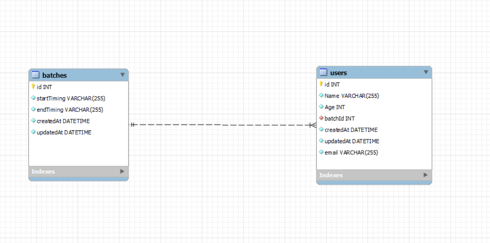

# YogaClass Admission Form

A simple admission form for yoga classes that allows users to enroll in monthly classes and make payments.

## Description

This project is a simple admission form for yoga classes that allows users to enroll in monthly classes and make payments. The backend is built using Express and MySQL, and the frontend is developed using React.

## Features

### Functionalities

- Users can enroll for monthly yoga classes.
- Monthly fees are paid on a month-to-month basis.
- Age limit: Participants must be between 18 and 65 years old.
- Four batches available each day: 6-7 AM, 7-8 AM, 8-9 AM, and 5-6 PM.
- Participants can choose any batch each month and can switch batches monthly.

## Getting Started

    Clone the repository to your local machine using the following command:
    
```bash
git clone https://github.com/alpha951/flexmoney.git
```

## Project Structure

- **backend**: Contains the Express server and MySQL database setup.
- **frontend**: Contains the React application for the admission form.

## Frontend Setup

1. **Install dependencies:**

    ```bash
    cd client
    npm install
    ```

2. **Build the frontend:**

    ```bash
    npm run build
    ```

## Backend Setup

1. **Install dependencies:**

    ```bash
    cd server
    npm install
    ```

2. **Configure the database**
    Update the config/config.json file with your MySQL database credentials.

3. **Install dependencies:**

    ```bash
        cd backend
        npm install
    ```

    > It's crucial to note that your local machine should have a database called `database_development` to run below command.
    ```bash
        npx sequelize db:create
    ```

4. **Run the migration to create the necessary tables:**

    ```bash
    cd src
    npx sequelize db:migrate
    ```

    > In case you face any error while running above command, please run below command to run individual migrations in the following order:
    ```bash
    npx sequelize db:migrate --name 20231218133501-create-batch
    npx sequelize db:migrate --name 20231218132005-create-user
    npx sequelize db:migrate --name 20231218162213-migration-add-email-user
    ```

    > To know more about sequelize cli commands refer [this](https://github.com/sequelize/cli?tab=readme-ov-file#usage).

5. **Seed the database with initial batch data:**

    ```bash
    npx sequelize db:seed:all
    ```

6. **Start the server:**

    ```bash
    npm start
    ```

## IMPORTANT
    In the current setup we are running the frontend and backedn on the same port by building the react frontend first. If one want to run the frontend and backend on different ports, please follow below steps:
    - Comment out the below line in server.js file:
        ```bash
                app.use(express.static(path.join(__dirname, "../../client/dist")));

                app.use("*", function (req, res) {
                res.sendFile(path.join(__dirname, "../../client/dist/index.html"));
                });
        ```
    - Go to the ./client/src/components/Form.jsx file and update the below line:
        ```bash
                const url = "/api/v1/user/signup";
        ```
        to
        ```bash
                const url = "http://localhost:3000/api/v1/user/signup";
        ```
    - Above change is required as we are running the frontend and backend on different ports. It's assumed that the backend is running on port 3000. If the backend is running on a different port, please update the above line accordingly. Also the frontend shouldn't be running on port 3000 as it will conflict with the backend port.
## Usage

- Open your browser and go to <http://localhost:3000>.
- Fill in the admission form with your details.
- Choose a batch and click "Submit."

## ER Diagram



## Points to Note

- The database is seeded with 4 batches for each day. The batch timings are as follows:

```
    - 6-7 AM
    - 7-8 AM
    - 8-9 AM
    - 5-6 PM
```

- I decided not to update the username and other fields once he/she has registered for the current month. This is because the user might have already paid for the current month and updating the username would mean that the user would have to pay again for the current month. However, the user can update the username for the next month.

- For the abovementioned point, I could've written a separate logic so only the other details except the `batchId` can be updated. However, I decided to keep it simple and not allow any updates once the user has registered for the current month.

- As of now there is no APIs to add batches. However, I have written the migrations and seeders for the same. I can add the APIs if required. The DB admin can add batches using SQL queries as well.

- **Point of concern** : I'm iterating over complete user table to check if the user is already registered for the current month. This is not a good practice as the user table can grow very large. We can use a separate table to store the current month's users and check if the user is already registered for the current month. However, I decided to keep it simple and not add any more tables.

- **Render is slow** : I've used Render platform to deploy the application with a free account and using planatscale database. The render platform is a bit slow and hence the application is slow. However, the application works fine on localhost.

